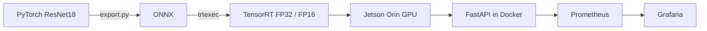

# NVIDIA AI Ops Lab

Hands-on CUDA and inference optimization on NVIDIA Jetson. Phase 1 builds a
measured ResNet18 serving path from model export to an observable containerized
service.

## Phase 1 architecture



The inference service reports request latency and the individual preprocessing,
H2D, TensorRT GPU, D2H, and postprocessing components. TensorRT benchmarks cover
strict FP32 and FP16 with 1, 2, 4, and 8 concurrent inference streams.

## Repository

```text
cuda/vector-add/              CUDA kernel and CPU/GPU benchmark
inference/resnet18/
├── app/                      TensorRT runtime and FastAPI service
├── benchmarks/               Reproducible performance runner
├── monitoring/               Prometheus and Grafana provisioning
├── scripts/                  Engine build and Nsight profiling
├── docker-compose.yml        Jetson service stack
├── RESULTS.md                Phase 1 measurements and findings
└── README.md                 ResNet18 setup and operations
```

Generated ONNX models, TensorRT engines, virtual environments, and profiler
reports are intentionally excluded from Git.

## Quick start

The deployment target is an NVIDIA Jetson Orin Nano Super Developer Kit running
Jetson Linux R39.2.1, TensorRT 10.16.2, and the NVIDIA Container Runtime.

```bash
cd inference/resnet18

# Export pretrained torchvision ResNet18.
python3 export.py

# Build strict FP32 and FP16 TensorRT engines.
./scripts/build_engines.sh

# Start inference, Prometheus, and Grafana.
sudo docker compose up --build -d

# Verify inference.
curl -F "file=@/path/to/image.jpg" http://localhost:8001/infer
```

Services:

- inference API and metrics: `localhost:8001`
- Prometheus: `localhost:9090`
- Grafana: `localhost:3000` (`admin` / `admin`)

See [the ResNet18 guide](inference/resnet18/README.md) for detailed commands and
[Phase 1 results](inference/resnet18/RESULTS.md) for benchmark methodology and
findings.
